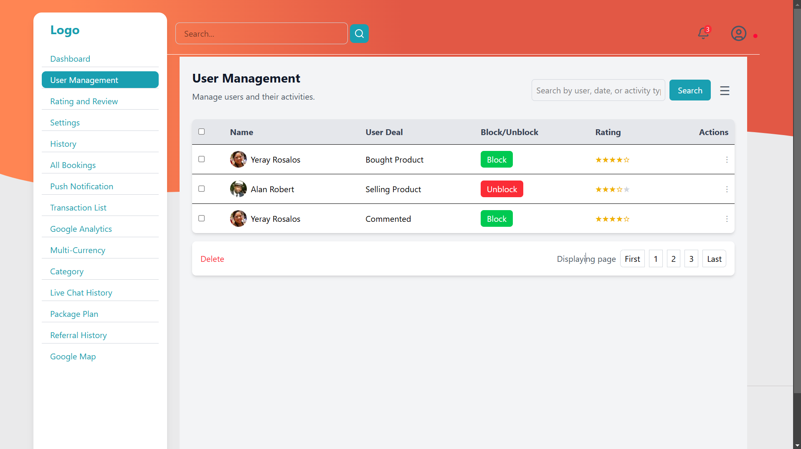
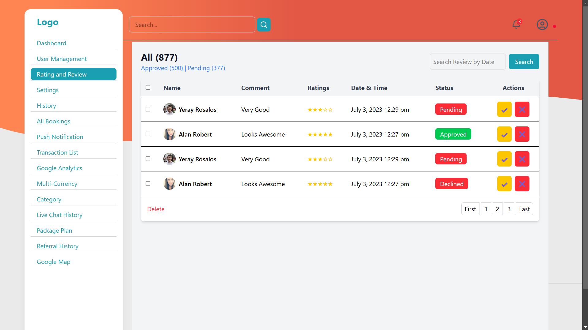
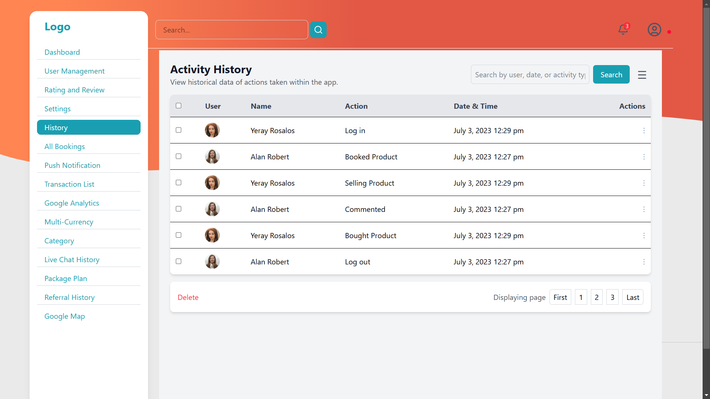
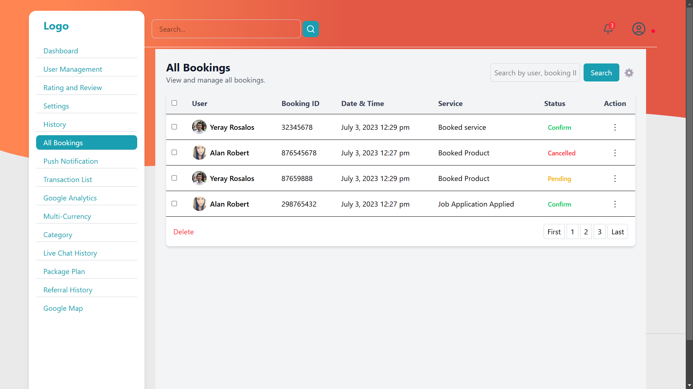

# Freeshopps Admin Panel

This repository contains the code for a static admin panel built as part of a machine task. The project includes five key screens that display core functionalities. Although the current implementation is static, it is designed to integrate APIs once the proper endpoints and authorization details are provided.

## Table of Contents

- [Introduction](#introduction)
- [Features](#features)
- [Screenshots](#screenshots)
- [Technologies Used](#technologies-used)
- [Installation](#installation)
- [Live Demo](#live-demo)
- [API Integration Challenges](#api-integration-challenges)
- [Project Structure](#project-structure)
- [Future Improvements](#future-improvements)
- [License](#license)

## Introduction

The Freeshopps Admin Panel was developed as a task within a 24-hour timeframe. The admin panel currently includes the following screens:

- **User Management**
- **Rating and Review**
- **History**
- **All Bookings**
- **Referral History**

Due to challenges in locating the exact API endpoints and handling authorization for certain data, the API integration is not complete. Once the appropriate APIs are provided, these screens can be easily updated to render dynamic data.

## Features

- **Responsive Design:** Ensures usability across different devices.
- **Modern User Interface:** Clean and intuitive layouts for efficient management.
- **Modular Code Structure:** Easily maintainable and extendable codebase.
- **Static Dashboard Screens:** Ready for API integration when available.

## Screenshots

Below are previews of the key screens. *(Replace the image paths with the actual paths to your screenshots.)*

### User Management


### Rating and Review


### History


### All Bookings


### Referral History


## Technologies Used

- **HTML5**
- **CSS3**
- **JavaScript**

*(If you used any frameworks or libraries, list them here.)*

## Installation

### Prerequisites

- A modern web browser.
- *(Optional)* Node.js and npm if you plan to extend the project or run a local server.

### Steps to Run Locally

1. **Clone the Repository:**

   ```bash
   git clone https://github.com/AnanthuSpace/freeshopps.git

2. **Navigate to the Project Directory:**

   ```bash
   cd freeshopps

3. **Open index.html in Your Browser:**

   You can simply open the file directly in your browser or run a local server.

##Live Demo 

You can view the live version of the project here: [Freeshopps](https://freeshopps-drqx.vercel.app/)

##API Integration Challenges

Due to the limited 24-hour timeframe and difficulties in identifying the correct API endpoints and handling authorization, API integration is currently not implemented. Once the proper APIs are provided, the following screens will be updated for dynamic data integration:

- User Management
- Rating and Review
- History
- All Bookings
- Referral History
